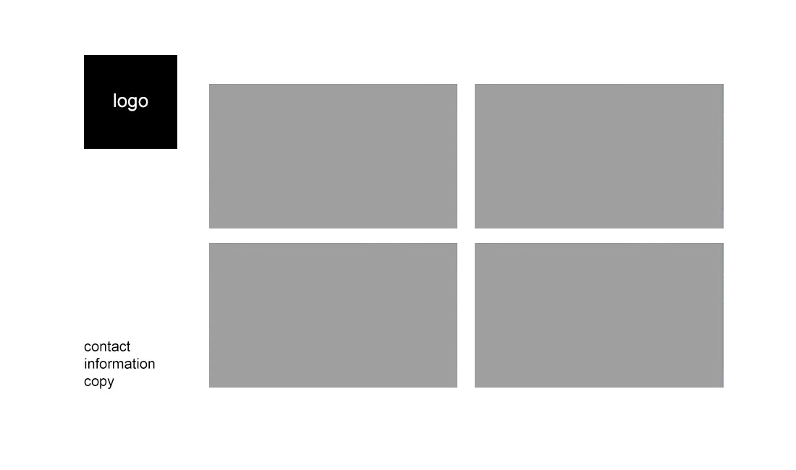

# LivingShapes
This was a project for school called Skills.

It's a website build in 135 minutes max time, with your own choice of tech-stack

I chose Vite with React + Typescript and Tailwindcss as my tech-stack

The website is fully optimized, giving a perfect score in google lighthouse on deployment at vercel: [https://livingshapes.vercel.app/](https://livingshapes.vercel.app/)

I wasn't able to fully complete the excercise because of given time but here are the requirements in Dutch:
[[PDF](A-opdracht-student.pdf)]

And the mockup:



## Dutch README
Om deze website zelf te draaien zijn er een paar stappen die je moet volgen
- Unzip de folder ergens op je computer
- Je hebt pnpm nodig om dit project te draaien, als je dit niet hebt kan je dit doen via ``npm install -g pnpm`` (Hiervoor heb je wel Node.js nodig) Je kan pnpm ook via ``winget install -e --id pnpm.pnpm`` installeren in PowerShell of Command Prompt.
- Als je de folder hebt geunzipped en je hebt pnpm geinstalleerd kan je de folder openen in je terminal door ernaartoe te navigeren of hem te openen in visual studio code.
- Run de command ``pnpm install`` om de node_modules te installeren en vervolgens ``pnpm run build`` en ```pnpm run preview`` om een live versie van de website te bekijken.
- Open de localhost link in je browser (waarschijnlijk ``localhost:4173``)
- Je kan op chrome ook rechtermuisknop -> inspect -> lighthouse -> analyze page load om de optimization te showcasen